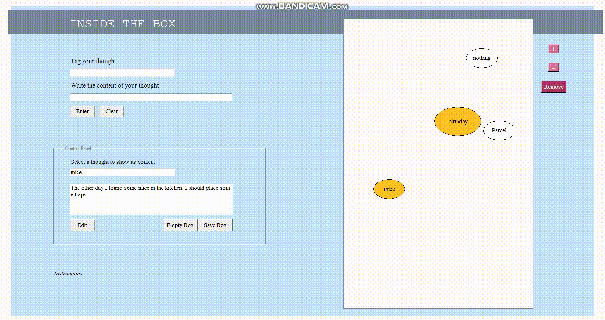

## Thought Box 
#### _Python 2.7_

The purpose of this project is the storage and observation of the different thoughts that pop into our minds and that happen relatively
often.The programme allows the user to enter enter a thought by providing both tag and content for each thought. Then, this input is 
materialized into an ovaled shape that floats freely in the box. Users can both edit their thoughts and increase or decrease thoughts´ 
size as they happen again. Size of the thoughts inside the box represents the frequency of occurrence of the thoughts 

# this is the first time

## this is the second time

### this is the third time

#### this is the fourth time

##### this is the fifth time

###### this is the sixth time

this is just text

[to the next page](https://rompelimbra.github.io/second)
