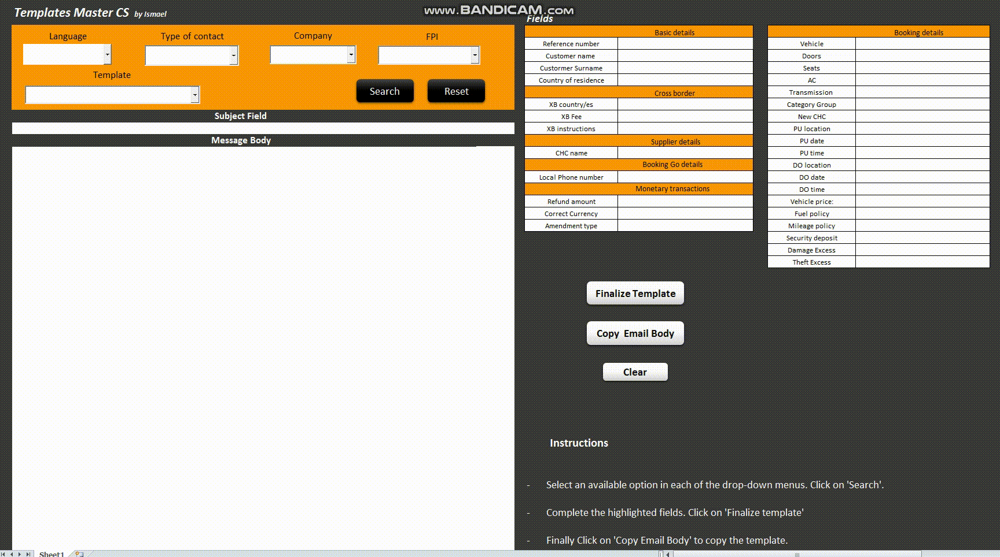

   

## Thought Box 
#### _Python 2.7_

The purpose of this project is the storage and observation of the different thoughts that pop into our minds and that happen relatively often.The programme allows the user to enter enter a thought by providing both tag and content for each thought. Then, this input is materialized into an ovaled shape that floats freely in the box. Users can both edit their thoughts and increase or decrease thoughts´ size as they happen again. Size of the thoughts inside the box represents the frequency of occurrence of the thoughts 

- [Download Zip File](https://github.com/Rompelimbra/Rompelimbra.github.io/archive/master.zip)
- [GitHub](https://github.com/Rompelimbra/Rompelimbra.github.io) 

       

## Texax Hold'em Starting hand selector
#### _Excel 2016 - VBA_

In Texas Hold'em Poker the hand dealt at the beggining of the game and the position of each player at the table is essential information  to decide one's next move. This Excel program provides a dynamic chart generator that guides the player as whether to fold, raise or call in the preflop round based on the starting hand, the position of the player at the table and the actions taken by previous players. 

- [Download Zip File](https://github.com/Rompelimbra/Rompelimbra.github.io/archive/master.zip)
- [GitHub](https://github.com/Rompelimbra/Rompelimbra.github.io) 

       

## Email template generator
#### _Excel 2016 - VBA_

The purpose of this project is the storage and observation of the different thoughts that pop into our minds and that happen relatively
often.The programme allows the user to enter enter a thought by providing both tag and content for each thought. Then, this input is 
materialized into an ovaled shape that floats freely in the box. Users can both edit their thoughts and increase or decrease thoughts´ 
size as they happen again. Size of the thoughts inside the box represents the frequency of occurrence of the thoughts

- [Download Zip File](https://github.com/Rompelimbra/Rompelimbra.github.io/archive/master.zip) <pre>                </pre> - [GitHub](https://github.com/Rompelimbra/Rompelimbra.github.io)  
 

[to the next page](https://rompelimbra.github.io/second)
